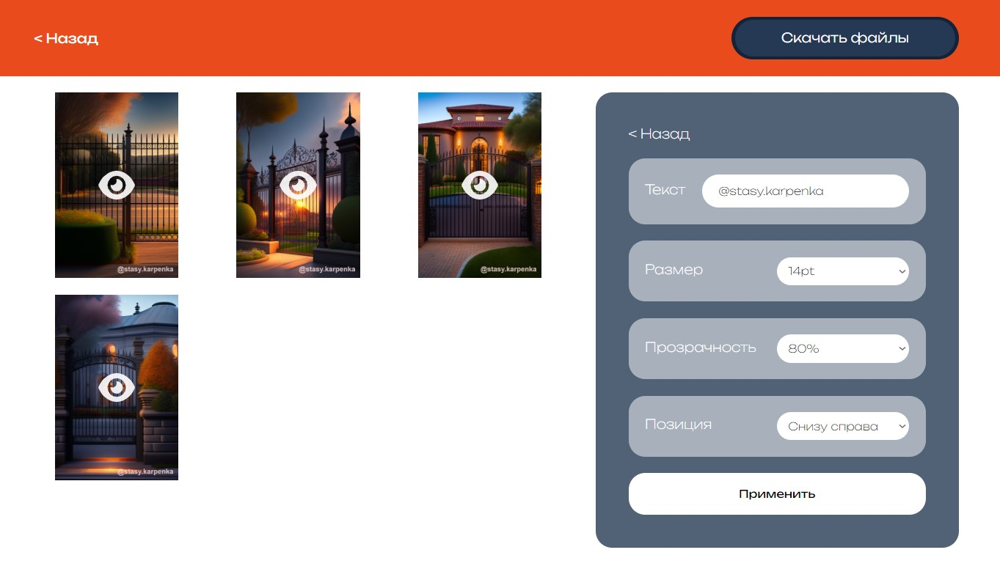
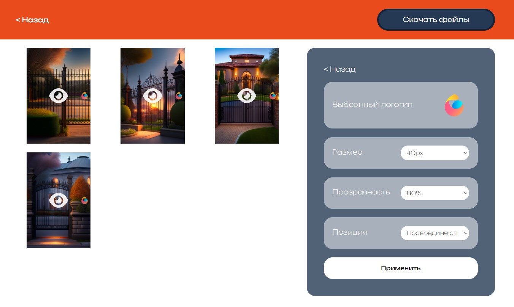
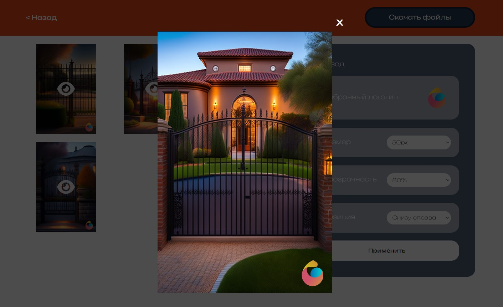

# Watermarks on photos
The application allows you to upload photos using drag and drop or selecting from files, with the ability to delete them. It also allows you to add a watermark to the photo (text, logo from a custom gallery or your own logo from your computer). Using the settings, you can choose the size of the text or logo, transparency and its position. Edited photos can be viewed in full size and then downloaded.

`Vanilla JS`  `Vite.js`  `Drag&Drop`  

# Try It 
https://adding-watermarks.vercel.app

# Preview 
<p align="center">
  
   
</p>
<p align="center">
   
   
</p>


# How to run/build 
```cmd
run:
npm i
npm run dev

build:
npm run build

commit build to repo: 
git add dist -f
git commit -m 'updated dist'
git push origin --delete gh-pages
git subtree push --prefix dist origin gh-pages
```

<sub>Made in 2023</sub>
